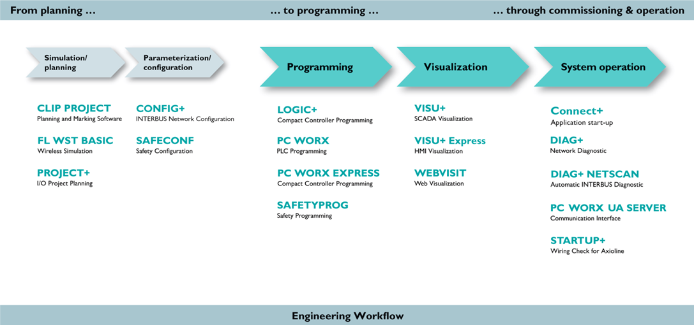

[AX Software Suite 1.85](https://www.phoenixcontact.com/online/portal/ru/?uri=pxc-oc-itemdetail:pid=2985660&library=ruru&tab=5) содержит:  
*   PC WORX - Демонстрационная версия (ограничение на использование модулей ввода/вывода)
*   PC WORX EXPRESS  - Полноценная бесплатная версия с поддержкой только [ILC 1XX](https://www.phoenixcontact.com/online/portal/ru/?uri=pxc-oc-itemdetail:pid=2700973&library=ruru&tab=5), [AXC 1050](https://www.phoenixcontact.com/online/portal/ru/?uri=pxc-oc-itemdetail:pid=2700988&library=ruru&tab=5) и [PC WORX SRT](https://www.phoenixcontact.com/online/portal/ru/?uri=pxc-oc-itemdetail:pid=2701680&library=ruru&tab=5)
*   WEBVISIT - Билдер Web-интерфейса контроллера, бесплатная версия
*   AX OPC SERVER - Служба для доступа к переменным контроллера по протоколу OPC DA 

Поддерживаемые операционные системы:
*   Windows 7 Professional (32 bit/64 bit), SP1 7 Ultimate (32 bit/64 bit), SP1
*   Windows 8.1 Professional (32 bit/64 bit) 8.1 Enterprise (32 bit/64 bit)
*   Windows 10 (32 bit/64 bit) Build 1511 и старше
